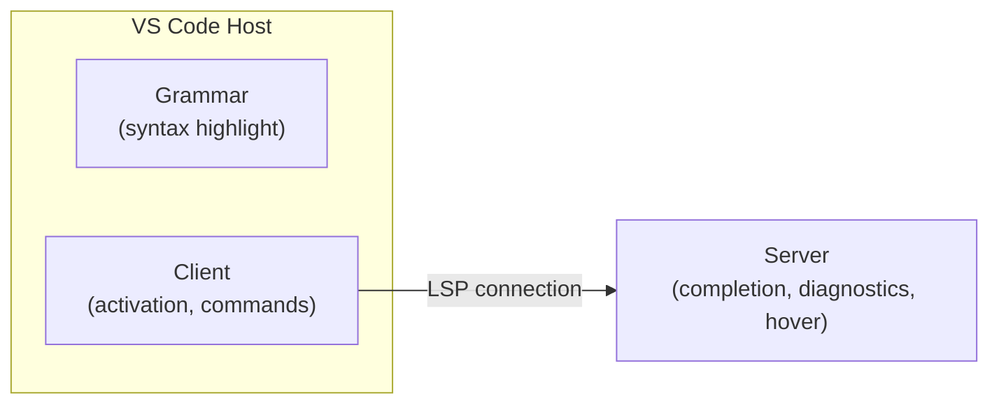

# Contributing to Levitate Extension

English | [中文](CONTRIBUTING_ZH.md)

Thank you for your interest in contributing to Levitate Extension! This guide will help you get started.

Please note that this project is released with a [Contributor Covenant Code of Conduct](CODE_OF_CONDUCT.md). By participating in this project you agree to abide by its terms.

## Prerequisites

- [Node.js](https://nodejs.org/) (LTS recommended)
- [pnpm](https://pnpm.io/) (package manager)
- [Visual Studio Code](https://code.visualstudio.com/)

## Getting Started

1. Fork and clone the repository:

   ```bash
   git clone https://github.com/<your-username>/Levitate-Extension.git
   cd Levitate-Extension
   ```

2. Install dependencies:

   ```bash
   pnpm install
   ```

3. Build the project:

   ```bash
   pnpm run build
   ```

4. Open the project in VS Code and press `F5` to launch the Extension Development Host.

## Project Architecture

This extension follows the standard VS Code [Language Server Protocol (LSP)](https://microsoft.github.io/language-server-protocol/) architecture:



| Module | Path | Responsibility |
| --- | --- | --- |
| **Grammar** | `packages/grammar/` | TextMate grammar for syntax highlighting, language configuration (brackets, comments, etc.) |
| **Client** | `packages/client/` | Extension entry point — activates the extension, starts the language server, registers commands |
| **Server** | `packages/server/` | Language server — provides auto-completion, diagnostics, hover info, document symbols |

## Development Workflow

### Build

Builds both client and server with sourcemaps enabled:

```bash
pnpm run build
```

Output goes to `dist/client/extension.js` and `dist/server/server.js`.

### Watch Mode

Automatically rebuilds on file changes — recommended during development:

```bash
pnpm run watch
```

### Lint & Format

This project uses [Biome](https://biomejs.dev/) for linting and formatting.

```bash
# Check for lint issues
pnpm run lint

# Auto-format all files
pnpm run format
```

A pre-commit hook runs `lint-staged` automatically to format staged files before each commit.

### Package

Build and package the extension into a `.vsix` file for distribution:

```bash
pnpm run package
```

## Debugging

### Client (Extension Host)

1. Open the project in VS Code.
2. Press `F5` to launch the **Extension Development Host** (a separate VS Code window with the extension loaded).
3. Set breakpoints in `packages/client/src/` — they will be hit when the extension activates.
4. The Debug Console in the original VS Code window shows `console.log` output and breakpoint inspection.

The launch configuration (`.vscode/launch.json`) automatically runs `pnpm run build` before launching.

### Server (Language Server)

The language server runs as a separate Node.js process. To debug it:

1. In the Extension Development Host, open a `.lvt` file to trigger the server to start.
2. Open VS Code's **Output** panel and select **Levitate** from the dropdown to see server logs.
3. To enable verbose logging, set `levitate.trace.server` to `verbose` in VS Code settings (Settings > Extensions > Levitate):
   ```json
   {
     "levitate.trace.server": "verbose"
   }
   ```
4. To attach a debugger to the server process, add this to `.vscode/launch.json`:
   ```json
   {
     "name": "Attach to Server",
     "type": "node",
     "request": "attach",
     "port": 6009,
     "restart": true,
     "outFiles": ["${workspaceFolder}/dist/server/**/*.js"]
   }
   ```
   Then update the server launch args in the client to include `--inspect=6009`.

### Grammar Debugging

To debug TextMate grammar issues:

1. Open a `.lvt` file in the Extension Development Host.
2. Use **Developer: Inspect Editor Tokens and Scopes** (`Ctrl+Shift+Alt+I` / `Cmd+Shift+Alt+I`) to see which scopes are applied to each token.
3. Compare the scopes against `packages/grammar/syntaxes/lvt.tmLanguage.json`.

## Adding Features

### Adding a New Keyword

1. **Grammar**: Add the keyword to `packages/grammar/syntaxes/lvt.tmLanguage.json` in the appropriate pattern (e.g., `keywords`, `control`, `subcommands`).
2. **Server completion**: Register the keyword in the completion provider in `packages/server/` so it appears in auto-suggestions.
3. **Server hover**: Add hover documentation for the keyword in the hover provider.
4. **Diagnostics**: If the keyword has specific syntax rules, add validation in the diagnostics provider.
5. **Localization**: Add descriptions in both `package.nls.json` (English) and `package.nls.zh-cn.json` (Chinese).

### Adding a New Subcommand

Subcommands follow the same steps as keywords, but are typically added to the `subcommands` section of the grammar and may have their own completion/hover entries.

## Project Structure

```
Levitate-Extension/
├── packages/
│   ├── client/
│   │   └── src/
│   │       └── extension.ts      # Extension entry point
│   ├── server/
│   │   └── src/
│   │       └── server.ts         # Language server entry point
│   └── grammar/
│       ├── syntaxes/
│       │   └── lvt.tmLanguage.json  # TextMate grammar rules
│       └── language-configuration.json # Bracket/comment config
├── assets/                        # Extension icons
├── dist/                          # Build output (not committed)
├── test/fixtures/                 # Test .lvt files
├── esbuild.config.mts             # Build configuration (client + server)
├── biome.json                     # Linter & formatter config
├── package.nls.json               # English localization
├── package.nls.zh-cn.json         # Chinese localization
├── .vscode/launch.json            # Debug launch configuration
└── .husky/pre-commit              # Pre-commit hook
```

## Code Style

- **Formatter**: Biome with tabs and double quotes
- **Linter**: Biome recommended rules
- All `.ts`, `.js`, `.mjs`, `.mts`, `.json`, `.html`, `.css` files are auto-formatted on commit

## Submitting Changes

1. Create a new branch from `main`:

   ```bash
   git checkout -b feat/your-feature
   ```

2. Make your changes, build, and test in the Extension Development Host.

3. Commit with a clear message:

   ```bash
   git commit -m "feat: add something"
   ```

4. Push to your fork and open a Pull Request against `main`.

### Commit Message Convention

This project follows [Conventional Commits](https://www.conventionalcommits.org/). Please prefix your commit messages accordingly (e.g. `feat:`, `fix:`, `docs:`).

## Reporting Issues

If you find a bug or have a feature request, please [open an issue](https://github.com/ChouChiu/Levitate-Extension/issues) with:

- A clear description of the problem or suggestion
- Steps to reproduce (for bugs)
- Expected vs. actual behavior
- VS Code version and OS

## License

By contributing, you agree that your contributions will be licensed under the [MIT License](LICENSE).
