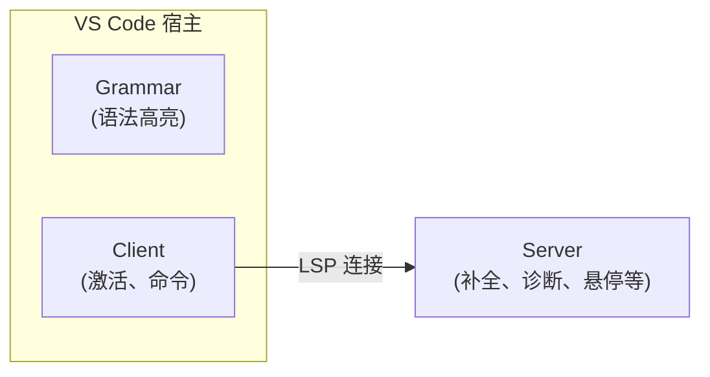

# 贡献指南

[English](CONTRIBUTING.md) | 中文

感谢你对 Levitate Extension 的关注！本指南将帮助你快速上手开发。

请注意，本项目发布了[贡献者行为准则](CODE_OF_CONDUCT_ZH.md)。参与本项目即表示你同意遵守其条款。

## 环境要求

- [Node.js](https://nodejs.org/)（推荐 LTS 版本）
- [pnpm](https://pnpm.io/)（包管理器）
- [Visual Studio Code](https://code.visualstudio.com/)

## 快速开始

1. Fork 并克隆仓库：

   ```bash
   git clone https://github.com/<your-username>/Levitate-Extension.git
   cd Levitate-Extension
   ```

2. 安装依赖：

   ```bash
   pnpm install
   ```

3. 构建项目：

   ```bash
   pnpm run build
   ```

4. 在 VS Code 中打开项目，按 `F5` 启动 Extension Development Host。

## 项目架构

本扩展遵循标准的 VS Code [语言服务器协议 (LSP)](https://microsoft.github.io/language-server-protocol/) 架构：



| 模块        | 路径                | 职责                                                      |
| ----------- | ------------------- | --------------------------------------------------------- |
| **Grammar** | `packages/grammar/` | TextMate 语法（语法高亮）、语言配置（括号、注释等）       |
| **Client**  | `packages/client/`  | 扩展入口 — 激活扩展、启动语言服务器、注册命令             |
| **Server**  | `packages/server/`  | 语言服务器 — 提供自动补全、诊断提示、悬停文档、文档符号等 |

## 开发流程

### 构建

构建客户端和服务端，同时生成 sourcemap：

```bash
pnpm run build
```

输出到 `dist/client/extension.js` 和 `dist/server/server.js`。

### 监听模式

文件变更时自动重新构建，开发时推荐使用：

```bash
pnpm run watch
```

### 代码检查与格式化

本项目使用 [Biome](https://biomejs.dev/) 进行代码检查和格式化。

```bash
# 检查代码问题
pnpm run lint

# 自动格式化所有文件
pnpm run format
```

每次提交前，pre-commit 钩子会通过 `lint-staged` 自动格式化暂存的文件。

### 打包

将扩展构建为 `.vsix` 文件用于分发：

```bash
pnpm run package
```

## 调试

### 客户端（Extension Host）

1. 在 VS Code 中打开本项目。
2. 按 `F5` 启动 **Extension Development Host**（一个加载了扩展的独立 VS Code 窗口）。
3. 在 `packages/client/src/` 中设置断点 — 扩展激活时会命中断点。
4. 原始 VS Code 窗口的调试控制台会显示 `console.log` 输出并支持断点检查。

启动配置（`.vscode/launch.json`）会在启动前自动运行 `pnpm run build`。

### 服务端（语言服务器）

语言服务器作为独立的 Node.js 进程运行。调试方法：

1. 在 Extension Development Host 中打开一个 `.lvt` 文件以触发服务器启动。
2. 打开 VS Code 的 **输出（Output）** 面板，从下拉菜单中选择 **Levitate** 查看服务器日志。
3. 如需启用详细日志，在 VS Code 设置中将 `levitate.trace.server` 设为 `verbose`（设置 > 扩展 > Levitate）：
   ```json
   {
     "levitate.trace.server": "verbose"
   }
   ```
4. 如需将调试器附加到服务器进程，在 `.vscode/launch.json` 中添加：
   ```json
   {
     "name": "Attach to Server",
     "type": "node",
     "request": "attach",
     "port": 6009,
     "restart": true,
     "outFiles": ["${workspaceFolder}/dist/server/**/*.js"]
   }
   ```
   然后在客户端启动参数中加入 `--inspect=6009`。

### 语法调试

调试 TextMate 语法问题：

1. 在 Extension Development Host 中打开一个 `.lvt` 文件。
2. 使用 **Developer: Inspect Editor Tokens and Scopes**（`Ctrl+Shift+Alt+I` / `Cmd+Shift+Alt+I`）查看每个 token 被分配的 scope。
3. 对比 `packages/grammar/syntaxes/lvt.tmLanguage.json` 中的规则。

## 添加功能

### 添加新关键字

1. **语法**：在 `packages/grammar/syntaxes/lvt.tmLanguage.json` 中对应的部分（如 `keywords`、`control`、`subcommands`）添加关键字。
2. **补全**：在 `packages/server/` 的补全提供器中注册该关键字，使其出现在自动补全列表中。
3. **悬停**：在悬停提供器中添加该关键字的文档说明。
4. **诊断**：如果该关键字有特定的语法规则，在诊断提供器中添加校验逻辑。
5. **本地化**：在 `package.nls.json`（英文）和 `package.nls.zh-cn.json`（中文）中添加描述。

### 添加新子命令

子命令的添加步骤与关键字类似，但通常添加到 grammar 的 `subcommands` 部分，并可能有独立的补全和悬停条目。

## 项目结构

```
Levitate-Extension/
├── packages/
│   ├── client/
│   │   └── src/
│   │       └── extension.ts         # 扩展入口
│   ├── server/
│   │   └── src/
│   │       └── server.ts            # 语言服务器入口
│   └── grammar/
│       ├── syntaxes/
│       │   └── lvt.tmLanguage.json  # TextMate 语法规则
│       └── language-configuration.json # 括号/注释配置
├── assets/                           # 扩展图标
├── dist/                             # 构建产物（不提交）
├── test/fixtures/                    # 测试用 .lvt 文件
├── esbuild.config.mts                # 构建配置（客户端 + 服务端）
├── biome.json                        # Linter & 格式化配置
├── package.nls.json                  # 英文本地化
├── package.nls.zh-cn.json            # 中文本地化
├── .vscode/launch.json               # 调试启动配置
└── .husky/pre-commit                 # 提交前钩子
```

## 代码风格

- **格式化工具**：Biome，使用 Tab 缩进，双引号
- **代码检查**：Biome 推荐规则
- 所有 `.ts`、`.js`、`.mjs`、`.mts`、`.json`、`.html`、`.css` 文件在提交时自动格式化

## 提交变更

1. 从 `main` 创建新分支：

   ```bash
   git checkout -b feat/your-feature
   ```

2. 完成修改后，构建并在 Extension Development Host 中测试。

3. 使用清晰的提交信息：

   ```bash
   git commit -m "feat: 添加某功能"
   ```

4. 推送到你的 Fork，并向 `main` 分支发起 Pull Request。

### 提交信息规范

本项目遵循 [Conventional Commits](https://www.conventionalcommits.org/) 规范。请在提交信息中添加类型前缀（如 `feat:`、`fix:`、`docs:`）。

## 问题反馈

如果你发现了 Bug 或有功能建议，请[提交 Issue](https://github.com/ChouChiu/Levitate-Extension/issues)，并包含：

- 问题或建议的清晰描述
- 复现步骤（针对 Bug）
- 期望行为与实际行为
- VS Code 版本和操作系统

## 许可证

贡献代码即表示你同意你的贡献将在 [MIT 许可证](LICENSE) 下发布。
